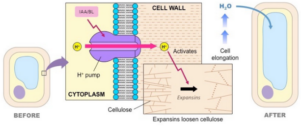

<!--
# 
-->

#  qbic-pipelines/root-tissue-analysis

**A reproducible analysis pipeline for pH measurements derived from fluorescence microscopy of *A. thaliana.* root tissue**.

[](https://github.com/nf-core/rts/actions?query=workflow%3A%22nf-core+CI%22)
[](https://github.com/nf-core/rts/actions?query=workflow%3A%22nf-core+linting%22)
[](https://nf-co.re/rts/results)
[](https://doi.org/10.5281/zenodo.XXXXXXX)

[](https://www.nextflow.io/)
[](https://docs.conda.io/en/latest/)
[](https://www.docker.com/)
[](https://sylabs.io/docs/)

[](https://nfcore.slack.com/channels/rts)
[](https://twitter.com/nf_core)
[](https://www.youtube.com/c/nf-core)

## Introduction

**qbic-pipelines/root-tissue-analysis** is a bioinformatics best-practice pipeline to analyze pH measurements from root tissue samples of *A. thaliana.*, these measurments are derived from fluorescence microscopy images. This pipeline aims to analyze pH measurments to validate the acid-growth hypothesis, which explains the expansion of cells in root tissue. This acid-growth pathway model needs substantial pH measurement data for validation, however this type of data generation is time consuming, since manual annotation of ROIs is a mayor bottle-neck. To mitigate this issue, the pipeline provides automatic, multi-class tissue segmentation (5 clases) using U-Net models, previously trained on a dataset generated and annotated by experienced plant biologists (https://github.com/qbic-pipelines/root-tissue-segmentation-core/).

<p align="center">
    
</p>

<p align="center">
    
</p>

This pipeline was created using [nf-core tools](https://nf-co.re/) and aims to adhere to its reproducibility standards. The pipeline is built using [Nextflow](https://www.nextflow.io), a workflow tool to run tasks across multiple compute infrastructures in a very portable manner. It uses Docker/Singularity containers making installation trivial and results highly reproducible.

<p align="center">
    
</p>

## Pipeline summary

#### Input

* Fluorescence microscopy image files, in `.czi` or `.ome.tif` (OME-TIFF) file format. Images of 512x512 pixels in size, and acquired with a target pixel size of 0.415133 µm, each with 4 channels in the following order:
1. Fluorescence signal obtained by excitation at 405 nm
2. Brightfield image for excitation at 405 nm
3. Fluorescence signal obtained by excitation at 458 nm
4. Brightfield image for excitation at 458 nm 

* Metadata table in `.csv` format, with 3 columns (filename, treatment, breeding line), e.g.:

```console
Filename,Treatment,Breeding Line
Image 70,Mock,bri1-301
Image 71,Mock,bri1-301
Image 114,BL,bri1-301
Image 115,BL,bri1-301
```


Sample input data: [`Testdata`](https://github.com/qbic-pipelines/root-tissue-analysis/blob/main/assets/testdata.tar.gz)

#### Output

* Brightfield and ratiomeric images with segmentation masks. Both in `.tiff` and `.npy` formats, and integrated as channels within OME-TIFF image files (`.ome.tif` format)
* Uncertainty and interpretability maps in `.ome.tif` format
* Average ratio table in `.tsv` format
* Pipeline report in HTML format


#### Steps

1. Fiji macro for ratimeric image conversion ([`RATIOCONV`])

    * `RATIOCONV` container: https://hub.docker.com/r/qbicpipelines/rtaratioconv

2. Root tissue segmentation. ([`ROOTSEG`]). This prediction module implements the Monte Carlo Dropout procedure (https://arxiv.org/abs/1506.02142) to calculate prediction uncertainty (uncertainty maps). The number of Monte Carlo samples is set by default to `T=10`. Additionally, this module uses the Guided Grad-CAM algorithm (https://arxiv.org/abs/1610.02391) to compute visualizations of input feature importance (interpretability maps), as implemented by the Captum library (https://captum.ai/).

    * Segmentation prediction module (mlf-core): https://github.com/qbic-pipelines/rts-prediction-package/
    * `ROOTSEG` container: https://hub.docker.com/r/qbicpipelines/rtarootseg

3. Export output images in OME-TIFF format ([`OMEOUT`])

4. Calculate statistics and write pipeline report ([`RTSSTAT`])

    * `RTSSTAT` container: https://hub.docker.com/r/qbicpipelines/rtastat

## Quick Start

1. Install [`Nextflow`](https://www.nextflow.io/docs/latest/getstarted.html#installation) (`>=21.04.0`)

2. Install any of [`Docker`](https://docs.docker.com/engine/installation/), [`Singularity`](https://www.sylabs.io/guides/3.0/user-guide/), [`Podman`](https://podman.io/), [`Shifter`](https://nersc.gitlab.io/development/shifter/how-to-use/) or [`Charliecloud`](https://hpc.github.io/charliecloud/) for full pipeline reproducibility _(please only use [`Conda`](https://conda.io/miniconda.html) as a last resort; see [docs](https://nf-co.re/usage/configuration#basic-configuration-profiles))_

3. Download the pipeline and test with profiles:

    > * To test with a local dataset in `.czi` format, stored in `root-tissue-analysis/assets/testdata.tar.gz`:

    ```console
    nextflow run . -profile test_local,docker
    ```

    > * To test with a local dataset in OME-TIFF format (`.ome.tiff`), stored in `root-tissue-analysis/assets/testdata_ome.tar.gz`:

    ```console
    nextflow run . -profile test_local_ome,docker
    ```

    > * To test with a remote dataset in `.czi` format (stored at [https://zenodo.org/record/5949352](https://zenodo.org/record/5949352)):

    ```console
    nextflow run . -profile test_remote,docker
    ```

4. Download the pipeline and test it on a minimal dataset with a single command:

    ```console
    nextflow run qbic-pipelines/root-tissue-analysis -profile test,<docker/singularity/podman/shifter/charliecloud/conda/institute>
    ```

    > * Please check [nf-core/configs](https://github.com/nf-core/configs#documentation) to see if a custom config file to run nf-core pipelines already exists for your Institute. If so, you can simply use `-profile <institute>` in your command. This will enable either `docker` or `singularity` and set the appropriate execution settings for your local compute environment.
    > * If you are using `singularity` then the pipeline will auto-detect this and attempt to download the Singularity images directly as opposed to performing a conversion from Docker images. If you are persistently observing issues downloading Singularity images directly due to timeout or network issues then please use the `--singularity_pull_docker_container` parameter to pull and convert the Docker image instead. Alternatively, it is highly recommended to use the [`nf-core download`](https://nf-co.re/tools/#downloading-pipelines-for-offline-use) command to pre-download all of the required containers before running the pipeline and to set the [`NXF_SINGULARITY_CACHEDIR` or `singularity.cacheDir`](https://www.nextflow.io/docs/latest/singularity.html?#singularity-docker-hub) Nextflow options to be able to store and re-use the images from a central location for future pipeline runs.
    > * If you are using `conda`, it is highly recommended to use the [`NXF_CONDA_CACHEDIR` or `conda.cacheDir`](https://www.nextflow.io/docs/latest/conda.html) settings to store the environments in a central location for future pipeline runs.

5. Start running your own analysis!

    ```console
    nextflow run qbic-pipelines/root-tissue-analysis -profile <docker/singularity/podman/shifter/charliecloud/conda/institute> --input folder
    ```

## Documentation

The qbic-pipelines/root-tissue-analysis pipeline comes with documentation about the pipeline [usage](https://github.com/qbic-pipelines/root-tissue-analysis), [parameters](https://github.com/qbic-pipelines/root-tissue-analysis) and [output](https://github.com/qbic-pipelines/root-tissue-analysis).

## Credits

qbic-pipelines/root-tissue-analysis was originally written by Julian Wanner and Luis Kuhn Cuellar.

## Contributions and Support

If you would like to contribute to this pipeline, please see the [contributing guidelines](.github/CONTRIBUTING.md).

## Citations

<!-- TODO nf-core: Add bibliography of tools and data used in your pipeline -->
An extensive list of references for the tools used by the pipeline can be found in the [`CITATIONS.md`](CITATIONS.md) file.

> Ewels PA, Peltzer A, Fillinger S, Patel H, Alneberg J, Wilm A, Garcia MU, Di Tommaso P, Nahnsen S. **The nf-core framework for community-curated bioinformatics pipelines.** Nat Biotechnol. 2020 Mar;38(3):276-278. doi: [10.1038/s41587-020-0439-x](https://dx.doi.org/10.1038/s41587-020-0439-x). PubMed PMID: 32055031.

> Heumos, L., Ehmele, P., Cuellar, L. K., Menden, K., Miller, E., Lemke, S., Gabernet, G., & Nahnsen, S. (2021). **mlf-core: a framework for deterministic machine learning.** In arXiv [cs.MS]. arXiv. http://arxiv.org/abs/2104.07651

> Barbez, E., Dünser, K., Gaidora, A., Lendl, T., & Busch, W. (2017). **Auxin steers root cell expansion via apoplastic pH regulation in Arabidopsis thaliana.** Proceedings of the National Academy of Sciences of the United States of America, 114(24), E4884–E4893.
